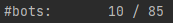

## Pubg-API-Java ##
In-progress. Actively updated

## Purpose ## 
This project started because I wanted to know how many bots were in the Pubg games I played. Upon seeing what the telemetry data looked like, I realized there were a lot of other statistics I could learn about, too. 

## Functionalities ##
As of July 2025, the PubgAPI-Java project has the following primary functionalities:

| WHAT    |   HOW   | WHERE | EXAMPLE OUTPUT |
|-------- | ------- | ----- | -------------- |
|0: countBotsAndPeople | Manually | BotCounts.java | [Screenshot](https://github.com/JS1936/PubgAPI-Java/blob/work2/documentation/samples/screenshot_countBotsAndPeople_example.png) |
|1: calculateKillCounts	| Manually | KillCounts.java | [Screenshot](https://github.com/JS1936/PubgAPI-Java/blob/work2/documentation/samples/screenshot_killCounts.png)|
|2: printPlayersByTeam | JSON | MatchPlayers.java | [Screenshot](https://github.com/JS1936/PubgAPI-Java/blob/work2/documentation/samples/Screenshot_PubgAPI-Java_printPlayersByTeam(still%20need%20to%20update%20maximum%20team%20capacity).png) |
|3: winnerWeapons |	JSON | MatchWeapons.java | [Screenshot](https://github.com/JS1936/PubgAPI-Java/blob/work2/documentation/samples/screenshot_winnerWeapons_example.png) |
|4: ranking (of a specific person)|	JSON | MatchRanking.java | [Screenshot](https://github.com/JS1936/PubgAPI-Java/blob/work2/documentation/samples/Screenshot_PubgAPI-Java_ranking.png) |
|5: calculateKillCountsJSON	|	JSON | KillCountsJSON.java | [Screenshot](https://github.com/JS1936/PubgAPI-Java/blob/work2/documentation/samples/Screenshot_PubgAPI-Java_partialOutputForKillCountsJSON.png) |
|6: printMapsPlayed | JSON | MapManager.java, MatchManager.java| [Screenshot](https://github.com/JS1936/PubgAPI-Java/blob/work2/documentation/samples/screenshot_printMapsPlayed_example.png) |

### Known Issues ###
* 0: None
* 1: "killCounts" - ambiguity in API's definition
* 2: Need to update calculation of team size
* 3: None
* 4: None
* 5: "killCounts" - ambiguity in API's definition
* 6: None

## Getting Started ##

### Clone Project ###
1. Clone PubgAPI-Java/work2 to local device.
2. Open project in Visual Studio Code (VSC).

### Prepare API Key ###
1. Go to the [Pubg Developer Portal](https://developer.pubg.com/).
2. Make an account.
3. Request a free API key.
4. Open project in VSC.
5. In terminal, navigate to PubgAPI-Java.
6. Create a local .env file.
7. In the .env file, type "API_KEY = ", then paste the API key.
8. Create a local .gitignore file.
9. In the .gitignore file, type ".env".
9. In terminal, type "./gradlew build" to build the build.gradle file.
10. Close and reopen the project.

### Acquire Data ###
Prerequisite: Complete the "Prepare API Key" section.  
To acquire new match data, run Main_API.java as follows:

1. Open Main_API.java.
2. See “API request = new API_Request(player, matchLimit)”. EX: (CoorsLatte, 15).
3. Replace the player name if desired. Use an existing player.
4. Replace the matchLimit if desired (recommended range: 1-15).
5. In build.sh, uncomment “mainClass = ‘Main_API’. Comment out “mainClass = ‘Main’.
6. In terminal, navigate to PubgAPI-Java.
7. Type “./gradle clean build"
8. Type “./gradlew run”

A "BUILD SUCCESSFUL" message means data collection is complete.  
Data should be stored at requestsDir/< player >/< timestamp >/matches.  
Example: requestsDir/Shrimzy/timestamp_1750557892980/matches  

### Analyze Data ###
To analyze match data collected, run Main.java as follows:

1. In build.sh, uncomment “mainClass = ‘Main’. Comment out “mainClass = ‘Main_API’.
2. In terminal, navigate to PubgAPI-Java.
3. Type “./gradle clean build"
4. Type “./gradlew run”
5. When prompted, enter the data storage location of the directory with files to analyze.   EX: "requestsDir/Shrimzy/timestamp_1750557892980/matches"
6. Choose a functionality to analyze the data with. EX: To countBotsAndPeople, type 0 and press enter.
7. Wait for data collection to complete.
7. To continue, type 'y' when prompted with "Any other requests? (y/n)".
8. To exit, type 'n' when prompted with "Any other requests? (y/n)".
7. The requestHistory.txt file should update to include recent analysis requests.

## User's Guide ##
* [How do I make an API request?](https://github.com/JS1936/PubgAPI-Java/files/10244822/Q_.How.do.I.make.an.API.request_.pdf)
* [What file(s) should I modify?](https://github.com/JS1936/PubgAPI-Java/files/10245164/Q_.What.file.s.should.I.modify.pdf)
* [What does it mean when a file is “ugly”, “pretty”, or becomes “prettified”?](https://github.com/JS1936/PubgAPI-Java/files/10245177/PubgAPI-Java.Q.pdf)

## Classes Breakdown ##

### Acquire Data ###
* API.java //getAPIkey(), getAPIplatform()
* API_Request.java //getPlayer(), getConnection(), getTimestamp(), connectToAPI(URL url), storeResponseToSpecifiedFileLocation(String dstPath)
* Main_API.java //main. As of 17 Nov 2022, program runs from Main_API.java.

### Managers ###
* FileManager.java //makePretty, storeFileAsString, getFile, writeToFileAndConsole
* JSONManager.java //getJSONObject, returnObject, returnMultipleObjects
* MapManager.java //printMapNames (and getMapName, dashed out because present in MatchManager.java)
* MatchManager.java //printMatchInfo, getMatchID, getPlayerPerspective, getMatchType, 

### Calculate Statistics ###
* BotCounts.java //countBotsAndPeople(File prettyFile) 
* KillCounts.java //printKillCountsToHistoryAndConsole, printKillCounts, calculateKillCounts
* KillCountsJSON.java //printKillCountsJSON, calculateKillCountsJSON
* Main.java //main, pseudoMain, getInfo, printOptionsToChooseFrom, initiateFunctionalities, getInput, getRequestType, getTeamSizeForOfficialMatch, weaponFrequencies, winnerWeapons, printPlayersByTeam, getMapName
* Ranking.java //ranking
* MapManager.java and MatchManager.java //printMapNames; MatchManager methods being reworked

### Inefficient ###
* Request.java //getRequest, getTypes, getScopes, getRequest_type, getRequest_scope -- removed

## [Updates](https://github.com/JS1936/PubgAPI-Java/blob/work2/UpdatesRecord.md)

## Areas for Improvement ##
* Efficient memory usage/storage
* Readability / simplicity
    * Removal of unneeded code and/or comments
    * Clarity with naming
    * Brevity / clarity of commit messages
    * Inclusion of dates when making updates
    * Consistent organization of classes
* API request process
    * Ease of API request --> project request transference (currently is unclear and likely labor-intensive for outside viewer)
    * Current state of API requests is very limited in how the request can vary
* Comprehensiveness and speed of testcases
* Inclusion of more example files (with explanations for how to install/run the program, step-by-step)
* Inclusion of sample description of end-user personas

## After Bob ##
Note: Bob, you were very persistent. Resistance was futile. I'm sorry. [235e88c](https://github.com/JS1936/PubgAPI-Java/tree/235e88c253b8e268b0f769325ce70b4b1b9d7750)
